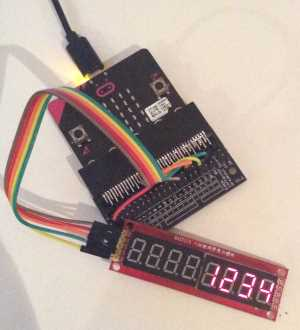
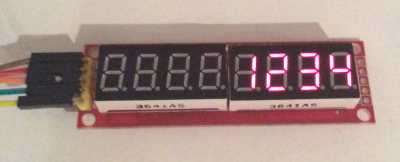
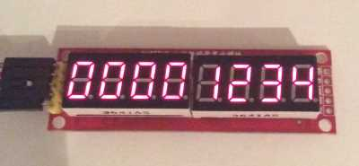
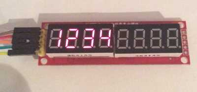

microbit MAX7219 7-segment driver
=================================

A Python module for using a 7-segment display driven by a MAX7219 chip.

## Using in your Program

There are two ways to include the module in your Python program:

#### Quick and Easy

Cut and paste the module to the top of your program.

#### Proper Ways

The correct approach is to copy the module to the filesystem. It can then be accessed in the same way the `microbit` module is imported at the start of each program.

There are two steps: copying the module to the microbit and importing the module into your program.

##### Copying the module:

1. Save the matrix7seg.py file to your computer.

2. Copy the downloaded module to the `/mu_code/` directory in the root of your home directory.

3. Flash your program to mu.

4. An error message will scroll across the screen about the lack of the matrix7seg module.

5. Once it has finished, click the 'files' icon in mu and upload the `matrix7seg.py` file to your microbit.

6. Press reset on your microbit. When the program runs again it will load the module.

##### In your program:

```
from microbit import spi

# from matrix7seg.py import Matrix7seg class
from matrix7seg import Matrix7seg

# microbit connected to default SPI pins. pin0 is chip select. 
# pin1 or pin2 etc could be used instead.
seg_display = matrix7seg(spi, pin0)

```

## Hardware / Electronics Setup

This library is for modules with 2 x 4 digit 7-segment LED displays driven by the MAX7219 chip. These are available from amazon, ebay, and other fine retailers. It is possible to  drive modules with one 4 digit 7-segment LED display. Modify the `NUM_DIGITS` variable in `matrix7seg.py`.

My module has 5 pins, each of which need to be connected to the microbit:

The MAX7219 is controlled over SPI. In addition to the VCC and GND wires, three are used by the module:

* CS / Chip Select: Goes low when data is being transmitted to the device. Goes high at the end of transmission. `.write_digital()` is used for this.
* DIN: Data transmitted over this wire.
* CLK: Tells the microbit when to transmit data.

#### Wiring



The MAX7219 uses SPI so must connect on pins 13 and 14 which are not exposed. You will need a breakout board (above) to access them.

This is the wiring table:

| My Module Label | Possible Label Names | microbit pin | Microbit doc names for pin |
|--- |--- |--- |--- |
| VCC |  | 3v | |
| GND |  | GND | |
| DIN | SOMI, SDI, DI, DIN, SI, MRST. | pin14 | MISO (master in, slave out) |
| CS | nCS, CSN, nSS, STE, SYNC | pin0 | n/a, but frequently called _chip select_ |
| CLK | SCLK | pin13 | Serial Clock | 

* *Your module might also have a `DOUT` pin. Ignore it!*

## Using in Python

With `matrix7seg` on the microbit and the wires connected it is possible to drive the display:

First import the class and initialise it:

```
# only spi is imported to save memory
from microbit import spi

# from matrix7seg.py import Matrix7seg class
from matrix7seg import Matrix7seg

# microbit connected to default SPI pins. pin0 is chip select. 
# pin1 or pin2 etc could be used for chip select instead.
seg_display = matrix7seg(spi, pin0)
```

Then show a number; it must be 8 or fewer digits long.

```
seg_display.write_number(1234)
```

This writes `1234` to a buffer. Calling `.show` writes this buffer to the display.

```
seg_display.show()
```

Essentially it updates the display.

## Examples:



```
# display a number
seg_display.write_number(1234)
```



```
# empty 7-segments filled with 0
seg_display.write_number(1234, zeroPad=True)
```


```
# justify numbers to left
seg_display.write_number(1234, leftJustify=True)
```
```
# sequentially write numbers to 100
for i in range(100)
    seg_display.write_number(i)
    seg_display.show()
```

```
# read and display the temperature every 10 seconds
while True:
    seg_display.write_number(temperature())
    seg_display.show()
    sleep(1000)
```

```
# record total acceleration experienced by the microbit
# if it's the highest value recorded by the microbit, display the reading on the screen:
# importing as little as possible to save memory

from microbit import spi, accelerometer, sleep, pin0
from math import sqrt
from matrix7seg import Matrix7seg

def total_acceleration():
    """
    return total acceleration in g across all 3 axes.
    """
    x = accelerometer.get_x()
    y = accelerometer.get_y()
    z = accelerometer.get_z()

    # root of sum of squares
    total = sqrt(x**2 + y**2 + z**2)
    return total

highest_reading = 0 

segment = Matrix7seg(spi, pin0)

while True:
    reading = total_acceleration()
    if reading > highest_reading:
        highest_reading = reading
    segment.write_number(highest_reading)
    segment.show()
```

### Notes 
* Memory can get tight so be careful about what is imported from the microbit module. To use the 7-segment display, you only need to import spi from the microbit module, eg: `from microbit import spi`. To show the temperature on the display as in the examples above, you would need to import that as well: `from microbit import spi, temperature`

* This is a mash up of [Radomir Dopieralski's driver][1] & [Richard Hull's Raspberry Pi driver.][2]

[1]: https://bitbucket.org/thesheep/micropython-max7219/src/280d2da980f7d5dc14683246a808cf6a908d087d/max7219.py?at=default&fileviewer=file-view-default
[2]: https://github.com/rm-hull/max7219/blob/master/README.rst